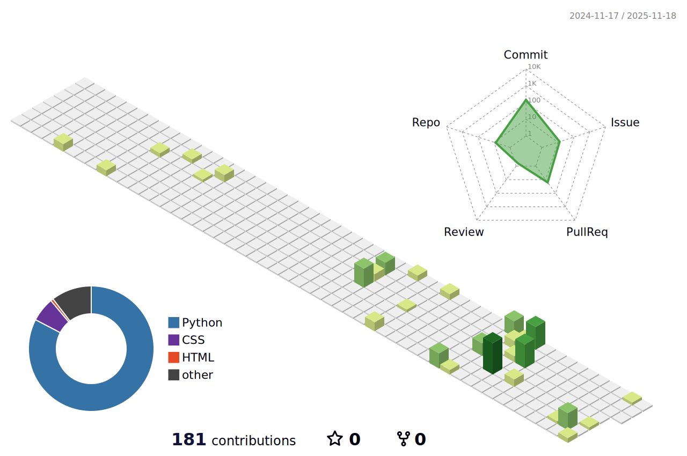

# 👋 Hello! My name is Alexandra!

  

I'm a **developer** learning Python 🐍 and web development. I enjoy creating convenient, beautiful and understandable applications.

### 🚀 What am I doing now?

* 🔥 Learning Python, Flask, Django
* 🎨 Diving into the world of web design and UX/UI
* 🗃️ Working on creating my own website
* 📚 Developing in the field of data analytics and SQL

---

### 🛠️ My tech stack:

---

### 📊 GitHub Contributions Calendar

---

### 📫 How to contact me:

* **Telegram:** [@Alex_Gicheva](https://t.me/@Alex_Gicheva)
* **Email:** [alexgicheva@gmail.com](mailto:alexgicheva@gmail.com)

---

### 🌟 My first projects:

* [Password Generator](https://github.com/SkriptSparrow/PasswordGenerator) – This is a password generator.
* [Harry Potter Quiz Bot](https://github.com/SkriptSparrow/HarryPotterQuizBot) – This is a telegram bot quiz about Harry Potter.

---

✨ **Thanks for visiting! Enjoy browsing my GitHub!** ✨
